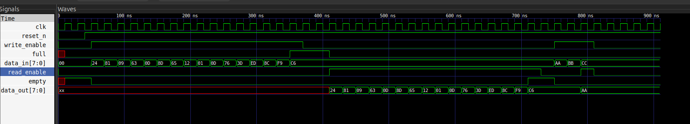

# Parametric Synchronous FIFO Buffer

A high-performance, fully synthesizable **Synchronous FIFO (First-In, First-Out) Buffer** implemented in Verilog. This module is designed to queue and buffer data streams sharing a single clock domain, featuring parametric data widths, pointer wrap-around management, and robust concurrency protection.

---

## 🚀 Key Features

*   **Fully Parametric Architecture:** Easily configure `DATA_WIDTH`, `ADDR_WIDTH`, and `FIFO_DEPTH` at instantiation.
*   **True Concurrency Control:** Uses an independent, `case`-structured status counter to handle simultaneous read and write operations on the exact same clock edge without data corruption or flag lagging.
*   **Robust Guardrails:** Built-in overflow and underflow protection logic. The module automatically rejects invalid writes when full and flags forced reads when empty.
*   **Hardware Optimized:** Avoids redundant global memory resets to optimize cell-area utilization during synthesis while guaranteeing pointer predictability.

---

## 📊 Technical Architecture & Interface

### Signal Description

| Signal Name | Direction | Width | Description |
| :--- | :--- | :--- | :--- |
| `clk` | Input | 1 bit | Core system clock (50 MHz) |
| `reset_n` | Input | 1 bit | Active-low asynchronous/synchronous master reset |
| `write_enable`| Input | 1 bit | Asserted to write `data_in` into the buffer |
| `data_in` | Input | `[DATA_WIDTH-1:0]` | Incoming data bus |
| `read_enable` | Input | 1 bit | Asserted to read the next item out to `data_out` |
| `data_out` | Output | `[DATA_WIDTH-1:0]` | Outgoing data bus (Registered output) |
| `full` | Output | 1 bit | Active-high flag indicating zero remaining slots |
| `empty` | Output | 1 bit | Active-high flag indicating zero elements stored |

---

## 🛠️ Verification & Simulation Workflow

The design was verified using a self-checking testbench compiled with **Icarus Verilog (iverilog)** and verified visually via **GTKWave** on Ubuntu.

### How to Run Simulation

Ensure you have `iverilog` and `vvp` installed:
```bash
sudo apt-get install iverilog gtkwave

iverilog -o fifo_sim fifo.v fifo_tb.v
vvp fifo_sim
```

### Testbench Coverage Scenarios
## Reset Validation: 
Assures empty asserts high and pointers initialize to 0 upon reset release.

## Saturation Test: 
Writes continuous unique data bursts up to FIFO_DEPTH (16 items) to validate the assertion of the full flag and verify safety overrides against overflow.

## Drain Test:
Reads back all 16 stored items continuously to verify correct FIFO sequencing, data preservation, and eventual underflow protection.

## Concurrent Stress Test: 
Fires simultaneous write_enable and read_enable operations on a partially filled buffer to validate clock-edge tracking stability.


### Verification Waveform Analysis
Below is the verified timing execution profile extracted during simulation, demonstrating clean boundary-flag switching and zero-latency status response:



### Synthesis & Hardware Targets
## Target Toolchains: 
Fully compliant with Xilinx Vivado, Intel Quartus, and Yosys open-source synthesis tools.

## Timing Optimization: 
The flag assignments (full and empty) are tied directly to the registered status count vector, removing long combinational lookup strings and maximizing Fmax (Maximum Operating Frequency) by shortening the critical path.
